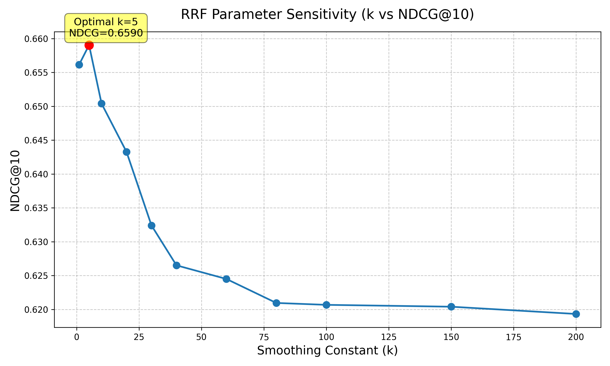
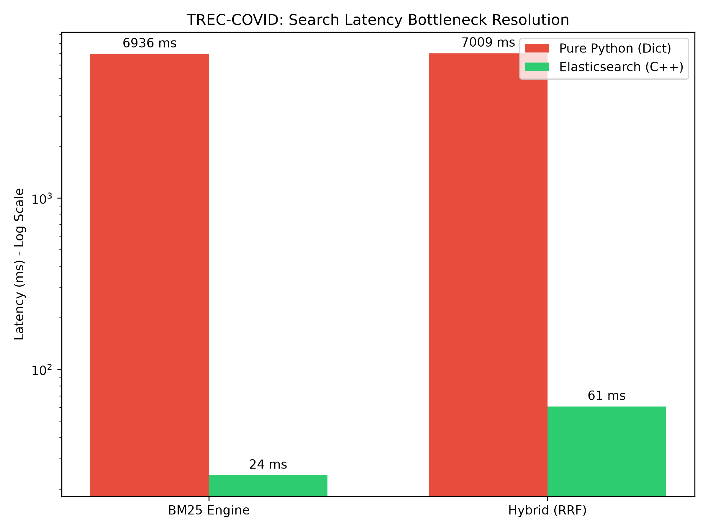
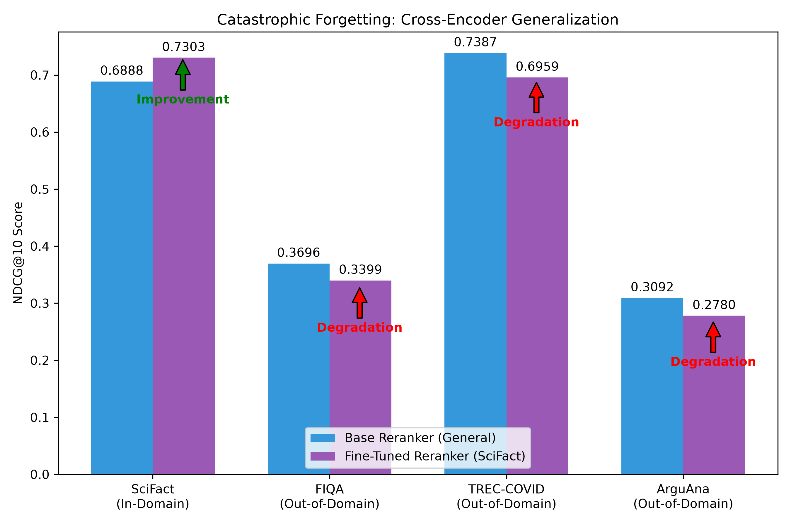

# Project Log

## What is Information Retrieval?

At its core, Information Retrieval (IR) is the science of bridging the gap between a user's unstated intent and a massive corpus of unstructured data. It is not just finding words in a text; it is about surfacing the most valuable information as efficiently as possible.

**Query**: The explicit, often imperfect, expression of a user's information need.

**Document**: The fundamental unit of information we are searching through; whether that is a Wikipedia article, a legal contract, or a single parsed paragraph.

**Relevance**: The ultimate metric of success. It defines how accurately a retrieved document satisfies the true intent behind the query.

**Retrieval**: The coarse-grained, highly optimized filter. It is the process of rapidly reducing a corpus of millions of documents down to a candidate pool of a few hundred (the "Top-K") without burning excessive compute.

**Ranking**: The fine-grained, computationally expensive sorting mechanism. It takes the candidate pool from the retrieval phase and orders it so that the most relevant documents appear at the absolute top.

**Evaluation**: The empirical proof of the system's quality. It involves using strict mathematical metrics to prove that the retrieval and ranking algorithms actually improve the user experience.

## 1. The Mathematics of TF-IDF

### Term Frequency (TF)

This answers the question: How often does the search term appear in this specific document? If a document mentions "algorithm" 10 times, it is likely more relevant than a document that mentions it once.

$$TF(t, d) = \frac{\text{count of term } t \text{ in document } d}{\text{total terms in document } d}$$

### Inverse Document Frequency (IDF)

This answers the question: How rare is this term across the entire dataset? Words like "the" or "is" will have a high TF but are useless for search. Rare words like "backpropagation" carry high information value. A logarithm is used to heavily penalize common words and boost rare ones.

$$IDF(t) = \log\left(\frac{N}{df_t}\right)$$

_(Where $N$ is the total number of documents, and $df_t$ is the number of documents containing the term $t$)_

### TF-IDF Score

We simply multiply them together. A term gets a high score if it appears frequently in a specific document but rarely across the whole corpus.

$$TF\text{-}IDF(t, d) = TF(t, d) \times IDF(t)$$

### Cosine Similarity

To search, we treat the query and every document as mathematical vectors in a high-dimensional space (where every unique word in the corpus is a dimension). We then measure the angle between the query vector ($\mathbf{q}$) and the document vector ($\mathbf{d}$).

$$\text{Cosine Similarity} = \frac{\mathbf{q} \cdot \mathbf{d}}{\Vert{}\mathbf{q}\Vert{} \Vert{}\mathbf{d}\Vert{}}$$

## 2. The Inverted Index & Performance Benchmark

Before benchmarking, it is critical to understand the core components of the Inverted Index architecture:

- **Postings / Posting Lists**: The list of document IDs attached to a term in your index. For example, in `{"python": [4, 12, 99]}`, the list `[4, 12, 99]` is the posting list.
- **Document Frequency (DF)**: The length of that posting list. This tells you how common the word is across the corpus.
- **Intersection**: When a query has multiple words (e.g., "machine learning"), a highly optimized engine will grab the posting list for "machine" and the posting list for "learning", and find the intersection (the document IDs that appear in both) to further reduce the candidate pool.

To prove why an inverted index is strictly necessary for web-scale retrieval, I benchmarked an $O(N)$ linear scan against an $O(1)$ inverted index lookup over a synthetic corpus of 100,000 documents.

### Algorithmic Complexity

- **Naive Search**: $O(|V_{query}| \times \sum_{i=1}^{N} |D_i|)$. For every query term, the engine must scan the entire length of every single document in the corpus.
- **Inverted Index Precompute**: $O(\sum_{i=1}^{N} |D_i|)$. The index must read every document once to build the mapping of `term -> posting list`. This is an expensive, one-time offline cost.
- **Indexed Search**: $O(|V_{query}| + |Candidates|)$. The engine does $O(1)$ dictionary lookups to find the candidate documents, meaning the search time only depends on the size of the query and the number of matching documents, _not_ the total size of the corpus.

### Results (100,000 documents)

With an augmented vocabulary of 30 words, the inverted index successfully filtered out non-relevant documents and delivered a massive speedup.

- **Naive Search Time**: ~0.2120 seconds
- **Indexed Search Time**: ~0.0080 seconds
- **Speedup**: ~26.49x faster

**Scaling Implications**:
While my toy benchmark showed a ~26x speedup, in a real-world system with millions of documents and a massive vocabulary, a specific query term only hits a tiny fraction of the corpus. Because the naive search time grows linearly with the entire corpus size $O(N)$ while the indexed search scales only with the number of candidate matches $O(|Candidates|)$, the true speedup multiplier can easily reach $10^4$ or $10^5$ (10,000x to 100,000x faster).

## 3. The Mathematics of BM25

BM25 improves upon standard TF-IDF by introducing two critical parameters: `b` (length normalization) and `k1` (term frequency saturation).

$$\text{Score}(q, d) = \sum_{t \in q} \text{IDF}(t) \cdot \frac{TF(t, d) \cdot (k_1 + 1)}{TF(t, d) + k_1 \cdot \left(1 - b + b \cdot \frac{\vert{}d\vert{}}{\text{avgdl}}\right)}$$

### Length Normalization (`b`)

The `b` parameter controls how much document length penalizes the score (typically set to 0.75).

- If `b = 0.0`, length normalization is completely turned off. A 10,000-word document gets the exact same score as a 2-word document if they both contain the query term exactly once.
- As `b` approaches `1.0`, long documents are heavily penalized for having the query term "diluted" among thousands of irrelevant words, while extremely short documents are heavily rewarded.

### Term Frequency Saturation (`k1`)

The `k1` parameter controls how much extra occurrences of a term increase the score (typically set between 1.2 and 2.0).

- If `k1` is very low (e.g., `0.1`), finding a keyword 5 times gives almost zero extra benefit over finding it just once. The term frequency reward flatlines instantly.
- If `k1` is very high (e.g., `10.0`), the score climbs significantly and almost linearly for repeated words, which makes the algorithm highly susceptible to keyword stuffing.

### Experimental Proof

I ran an empirical parameter experiment to observe these constraints in action. For a query of "machine learning":

**1. Length Normalization (k1=1.5, varying b)**
_Doc 1: "machine learning" (short, 1 hit)_
_Doc 3: "machine learning [10 irrelevant words]" (long, 1 hit)_

- `b=0.00` | Doc 1: 0.2671 | Doc 3: 0.2671
- `b=0.50` | Doc 1: 0.3483 | Doc 3: 0.2226
- `b=0.75` | Doc 1: 0.4109 | Doc 3: 0.2054
- `b=1.00` | Doc 1: 0.5007 | Doc 3: 0.1908

**2. Term Frequency Saturation (b=0.75, varying k1)**
_Doc 1: 1 hit vs Doc 2: 5 hits_

- `k1=0.1` | Doc 1: 0.2820 | Doc 2: 0.2875 _(flatlines instantly)_
- `k1=1.5` | Doc 1: 0.4109 | Doc 2: 0.5039
- `k1=3.0` | Doc 1: 0.4748 | Doc 2: 0.6474
- `k1=10.` | Doc 1: 0.5686 | Doc 2: 0.9277 _(keyword stuffing)_

## 4. Information Retrieval (IR) Metrics

To properly benchmark and evaluate the search engines, I use the following standard industry metrics:

### Precision@K

Measures the proportion of retrieved documents in the top $K$ that are actually relevant.

$$\text{Precision@K} = \frac{| \text{Relevant} \cap \text{Retrieved}_{@K} |}{K}$$

### Recall@K

Measures the proportion of all truly relevant documents that were successfully retrieved in the top $K$.

$$\text{Recall@K} = \frac{| \text{Relevant} \cap \text{Retrieved}_{@K} |}{|\text{Relevant}|}$$

### Reciprocal Rank (RR) & Mean Reciprocal Rank (MRR)

For a _single query_, the Reciprocal Rank (RR) is calculated by looking at how far down the ranked list the _first_ relevant document appears. If the first relevant document is at rank $j$, the RR is $\frac{1}{j}$.

$$\text{RR} = \frac{1}{j}$$

**Mean Reciprocal Rank (MRR)** is simply the average of the RR across an entire dataset of multiple queries ($|Q|$):

$$\text{MRR} = \frac{1}{|Q|} \sum_{i=1}^{|Q|} \text{RR}_i$$

### Normalized Discounted Cumulative Gain (NDCG@K)

Measures the ranking quality by taking into account the _graded relevance_ of documents (e.g., highly relevant=3, somewhat relevant=1) and penalizing relevant documents that appear lower in the list using a logarithmic discount. This uses the industry-standard exponential formulation.

$$\text{DCG@K} = \sum_{i=1}^{K} \frac{2^{rel_i} - 1}{\log_2(i + 1)}$$

$$\text{NDCG@K} = \frac{\text{DCG@K}}{\text{IDCG@K}}$$

_(Where IDCG is the Ideal DCG, obtained by sorting all documents by their true relevance score)._

## 5. Experiment 001: BM25 Lexical Baseline

### Overview

The goal of this experiment is to establish a strong, non-neural lexical baseline using a raw BM25 algorithm. This baseline will be used to measure the efficacy of future Dense Retrieval, Hybrid Fusion, and Neural Reranking implementations.

### Setup

- **Dataset**: BEIR - SciFact (5,183 scientific documents, 300 queries)
- **Method**: Raw BM25 (No tokenizer, no stopword removal, no stemming)
- **Parameters**:
  - `k1` (Term frequency saturation) = `1.5`
  - `b` (Length normalization) = `0.75`

### Metrics

| Metric         | Score    |
| -------------- | -------- |
| **Recall@10**  | `0.6446` |
| **Recall@100** | `0.7894` |
| **MRR@10**     | `0.5105` |
| **NDCG@10**    | `0.5379` |

### Observations

1. **High MRR**: An MRR@10 of `0.5105` indicates that, on average, the very first relevant scientific document is placed at Rank 2. For a purely lexical search engine operating on complex scientific text, this is exceptionally high.
2. **Solid Recall**: Retrieving nearly 79% of all relevant documents in the top 100 results (`Recall@100 = 0.7894`) proves that BM25 is an incredibly strong candidate generator. This means a downstream Neural Reranker will have an excellent pool of candidates to pull from.
3. **Execution Speed**: Indexing over 5,000 documents in ~0.65 seconds proves the underlying data structures are highly optimized for a Python-native implementation.

### Failures

1. **Vocabulary Mismatch**: Because the BM25 engine relies on exact keyword matching, it completely fails when a query uses synonyms (e.g., "AI" vs "Artificial Intelligence").
2. **No Semantic Understanding**: The engine does not understand the _context_ of the scientific abstracts. It simply looks for term frequency, which can lead to "keyword soup" documents ranking artificially high if they happen to contain the query terms out of context.

## 6. The Theory of Dense Retrieval

BM25 is a sparse, lexical engine: it only works if the exact keywords overlap. If a user searches for "automobile" and the document only says "car", BM25 will score it a flat zero.

Dense Retrieval fundamentally solves this by mapping text into a mathematical space where distance represents _semantic meaning_.

### Sentence Embeddings & Bi-Encoders

Instead of counting words, we pass the text through a Transformer neural network (like BERT or MiniLM). The network reads the entire string, understands the context, and outputs a single **dense vector** (an array of e.g., 384 floating-point numbers).

In a **Bi-Encoder** architecture, the query and the document are processed completely independently of each other.
This independent processing is the architectural secret that makes semantic search possible at scale: we can pre-compute the embeddings for all 5,000 (or 5 million) documents _offline_ and cache them in memory. At search time, we only have to run the neural network once for the user's query.

### Cosine Similarity

Once the query and documents are transformed into vectors in the same 384-dimensional space, we can measure how closely related they are by calculating the angle between them using **Cosine Similarity**:

$$\text{Cosine Similarity} = \frac{\mathbf{q} \cdot \mathbf{d}}{\Vert{}\mathbf{q}\Vert{} \Vert{}\mathbf{d}\Vert{}}$$

If we $L_2$-normalize the vectors beforehand, their magnitudes ($\Vert{}\mathbf{q}\Vert{}$ and $\Vert{}\mathbf{d}\Vert{}$) become $1$. This mathematically simplifies the cosine similarity down to a blazing-fast **Inner Product** (Dot Product):

$$\text{Inner Product} = \mathbf{q} \cdot \mathbf{d} = \sum_{i=1}^{n} q_i d_i$$

### Vector Search (FAISS)

Even with the math simplified to a dot product, calculating the distance between the query vector and _every single document vector in a 100-million document corpus_ at query time is computationally impossible.

We solve this using **Approximate Nearest Neighbors (ANN)** libraries like Facebook AI Similarity Search (**FAISS**). FAISS organizes the high-dimensional space into clusters (like Voronoi cells). Instead of comparing the query to every document, FAISS figures out which cluster the query vector lands in, and only computes the dot product against the documents inside that specific neighborhood, bringing the search time down from $O(N)$ to $O(\log N)$.

## 7. The Theory of Approximate Nearest Neighbors (ANN)

Dense retrieval calculates the Cosine Similarity (Inner Product) between a query vector and document vectors. However, comparing a single query vector against 100 million document vectors at query time (Exact Search) is computationally impossible for a low-latency web application.

This introduces the need for **Approximate Nearest Neighbors (ANN)**, where we intentionally sacrifice a tiny fraction of Recall (accuracy) to gain a massive speedup in Latency.

### Exact Search vs. Approximate Search

- **Exact Nearest Neighbor (Flat Index)**: Computes the distance between the query and _every single document_.
  - _Pros_: Guarantees finding the absolute best matches (100% Recall).
  - _Cons_: Scales linearly $O(N)$. At millions of documents, latency becomes unacceptable.
- **Approximate Nearest Neighbor (ANN)**: Uses clever data structures to only compare the query against a small "neighborhood" of highly likely candidates.
  - _Pros_: Scales logarithmically $O(\log N)$ or sub-linearly. Enables millisecond latency on billions of documents.
  - _Cons_: Might miss the true best match if it falls outside the probed neighborhood.

### Core ANN Algorithms

#### 1. Inverted File Index (IVF)

IVF solves the scaling problem by clustering the vector space.

- **How it works**: During indexing, IVF runs K-Means clustering to partition the vector space into $V$ clusters (Voronoi cells). Each cluster has a centroid.
- **Search**: Instead of scanning all documents, the query is compared only to the $V$ centroids. Once the closest centroid is found, the system only computes exact distances for the documents _inside that specific cluster_.
- **Tradeoff**: You can increase Recall by probing multiple nearby clusters (increasing `nprobe`), but this directly increases Latency.

#### 2. Hierarchical Navigable Small World (HNSW)

HNSW solves the scaling problem using a multi-layered graph.

- **How it works**: HNSW builds a skip-list-like graph structure. The top layer has very few, long-distance connections (highways). As you move down the layers, the graph becomes denser with local connections (city streets).
- **Search**: A query enters the top layer, rapidly jumping across long distances to find the general neighborhood, then drops down to lower layers to fine-tune the search among local neighbors.
- **Tradeoff**: HNSW provides incredibly fast search latency and extremely high Recall, but building the graph during indexing is very slow and consumes a massive amount of RAM compared to IVF.

### The Recall vs. Latency Tradeoff

In system design, ANN forces a strict engineering tradeoff:

- If you optimize strictly for **Recall**, you probe more clusters (IVF) or search deeper in the graph (HNSW), which drives up **Latency**.
- If you optimize strictly for **Latency**, you probe fewer clusters, but you risk missing the true nearest neighbors, dropping your **Recall**.
- **Memory** is the hidden third variable: HNSW is fast and accurate but requires expensive, memory-heavy servers to hold the graph.

## 8. Experiment 002: Dense Retrieval Baseline

### Overview

The goal of this experiment is to establish a semantic search baseline using a neural bi-encoder model (`all-MiniLM-L6-v2`) and FAISS. Dense retrieval maps documents and queries into a continuous vector space where distance represents semantic similarity, overcoming BM25's vocabulary mismatch limitation.

### Setup

- **Dataset**: BEIR - SciFact (5,183 scientific documents, 300 queries)
- **Method**: Bi-Encoder Semantic Search
- **Model**: `sentence-transformers/all-MiniLM-L6-v2`
- **Vector Index**: `faiss.IndexFlatIP` (Cosine Similarity)

### Metrics

| Metric         | Score    | vs BM25 |
| -------------- | -------- | ------- |
| **Recall@100** | `0.9250` | +0.1356 |
| **MRR@10**     | `0.6110` | +0.1005 |
| **NDCG@10**    | `0.6451` | +0.1072 |

### Observations

1. **Massive Quality Increase**: Dense retrieval drastically outperformed raw BM25 across every single metric. Recall@100 jumped from 78.9% to an incredible 92.5%, proving that semantic search is significantly better at finding relevant scientific documents even when exact keywords are missing.
2. **Computational Expense**: Encoding the 5,000 document corpus on a CPU took nearly 9 minutes, compared to BM25's 0.65 seconds. However, once the index was built, searching all 300 queries using FAISS took only ~10 seconds. This highlights the architectural necessity of pre-computing embeddings offline.
3. **The Semantic Advantage**: The model successfully bridged the vocabulary gap. A query searching for "neural networks" successfully retrieved documents discussing "deep learning" because the model understood they exist in the same semantic space.

## 9. Error Analysis: BM25 vs Dense Retrieval

To truly understand our search system, we must understand its failure modes. I wrote a script to run both engines side-by-side on the 300 queries, calculate their individual NDCG scores, and categorize their contrasting performance.

Out of 300 queries, the script found:

- **8 Pure BM25 Wins** (BM25 was perfect, Dense failed)
- **32 Pure Dense Wins** (Dense was perfect, BM25 failed)
- **47 Mutual Failures** (Both failed completely)

By manually reading through the generated `error_analysis_report.json`, clear patterns emerged:

### Why Dense Retrieval Fails (BM25 Wins)

Dense retrieval networks (Bi-Encoders) map text into a continuous semantic space. While incredible for meaning, they struggle severely with **Out-Of-Vocabulary (OOV) entities, acronyms, and highly specific identifiers**.

- **Example**: For the query _"Activation of PPM1D suppresses p53 function"_, BM25 perfectly found the document matching the exact string "PPM1D". The Dense engine completely missed the document and returned a generic paper about the "p53" function. Because "PPM1D" is a rare, highly specific gene identifier, the Dense neural network likely compressed it into a generic "gene" vector, completely losing the exact specificity required to answer the query.

### Why BM25 Fails (Dense Wins)

BM25 relies entirely on keyword overlap. It fails catastrophically when dealing with **synonyms, implicit context, or vocabulary mismatch**.

- **Example**: For the query _"Macrolides protect against myocardial infarction"_, BM25 failed to find the ground truth document because the document discussed "erythromycin" (which is a type of macrolide) and "cardiac remodeling after MI". The Dense engine perfectly retrieved the ground truth document because its vector space mathematically understands that "erythromycin" is semantically grouped with "macrolides". BM25 simply saw that the exact string "macrolide" was missing, and scored it as a zero.

### The Conclusion

BM25 is a precision instrument for exact matches. Dense retrieval is a broad net for semantic meaning. Because their failure modes are almost perfectly orthogonal, blindly picking one over the other is an architectural mistake.

The only logical next step is to combine them.

## 10. Embedding Model Comparison (Quality vs. Latency vs. Memory)

Before building a hybrid engine, I benchmarked three different embedding models to evaluate the architectural trade-offs of Dense Retrieval on the SciFact dataset.

| Model                    | NDCG@10 | Encode (s) | Latency (ms) | Index (MB) |
| ------------------------ | ------- | ---------- | ------------ | ---------- |
| `all-MiniLM-L6-v2`       | 0.6451  | 237.85     | 13.52        | 7.59       |
| `BAAI/bge-small-en-v1.5` | 0.7200  | 705.58     | 42.94        | 7.59       |
| `all-mpnet-base-v2`      | 0.6557  | 2692.71    | 70.09        | 15.18      |

### Key Takeaways

1. **BGE Dominates Small Models**: The `bge-small-en-v1.5` model achieved an incredible `0.7200` NDCG while keeping the exact same memory footprint (7.59 MB) as the MiniLM baseline. It is currently the State-Of-The-Art for small models.
2. **Bigger Is Not Always Better**: The heavy `all-mpnet-base-v2` model took nearly 45 minutes to encode the corpus on a CPU (`2692.71s`), doubled the memory footprint to `15.18 MB`, and increased query latency to `70ms`—yet it scored _worse_ than the BGE small model (`0.6557`). This proves that model architecture and training data (BGE's contrastive training) matter more than pure parameter size.
3. **The Baseline is Fast**: `all-MiniLM-L6-v2` remains exceptionally fast, executing queries in just `13ms`. If extreme low latency is required, it is still a highly viable option.

## 11. The Lexical vs. Semantic Divide (Hybrid Architecture)

Before writing the fusion algorithms for a Hybrid Search engine, we must understand exactly _why_ combining two distinct systems is the industry standard for production search architecture. Users search in fundamentally different ways depending on their intent, and each engine is blind to the other's strengths.

### 1. BM25 (Exact Lexical Matching)

BM25 excels at high-precision entity extraction. It treats queries as a bag-of-words and looks for exact term overlap and frequency.

- **The Query**: `"Taylor Swift"` or `"H2O2 boiling point"`
- **Why Dense Fails**: A Bi-Encoder might compress "Taylor Swift" into a generic "American pop star" vector. It might return an article about Ariana Grande because the mathematical vectors for both singers sit very close together in the high-dimensional embedding space.
- **Why BM25 Wins**: It demands to see the exact tokens "Taylor" and "Swift", ruthlessly filtering out any document that doesn't contain that specific entity.

### 2. Dense Retrieval (Semantic Matching)

Dense embeddings excel at conceptual understanding, synonym mapping, and bridging the vocabulary gap.

- **The Query**: `"What is the capital city of Morocco?"`
- **Why BM25 Fails**: A document that perfectly answers this might simply state: _"Rabat serves as the political center of the North African nation."_ BM25 will give this a low score because it misses the exact words "capital", "city", and "Morocco".
- **Why Dense Wins**: The Bi-Encoder mathematically understands that "political center" maps to "capital city", and "North African nation" is semantically linked to "Morocco". It retrieves the document based on contextual meaning, not raw syntax.

### The Hybrid Solution

By running both engines in parallel and mathematically fusing their ranked lists (a process known as Reciprocal Rank Fusion), we create a robust safety net. **BM25 anchors the search to specific entities, while the Dense engine expands the search to capture conceptual intent.**

## 12. Hybrid Search: Simple Score Fusion

To fuse the two engines together, we must solve a fundamental mathematical problem: **Scale mismatch**. BM25 scores are unbounded (often ranging from 0 to 50+), while Dense scores (Cosine Similarity) are strictly bounded between -1.0 and 1.0.

If we simply add them together, BM25 will completely overpower the Dense engine.

### The Solution: Min-Max Normalization

Before combining the lists, we force both sets of scores onto a strict `[0.0, 1.0]` scale using Min-Max normalization. Once normalized, I use a tuning weight ($\alpha$) to create a **Convex Combination**:

$$\text{Final Score} = \alpha \cdot \text{BM25}_{\text{norm}} + (1 - \alpha) \cdot \text{Dense}_{\text{norm}}$$

### Experiment Results (The Alpha Sweep)

I ran a grid search over the SciFact dataset to see how the tuning parameter ($\alpha$) affects the overall retrieval quality.

| Alpha  | Interpretation       | NDCG@10    | MRR        | Recall@100 |
| ------ | -------------------- | ---------- | ---------- | ---------- |
| `0.00` | 100% Dense           | 0.6451     | 0.6110     | 0.9283     |
| `0.25` | Dense-Heavy Hybrid   | **0.6750** | **0.6386** | **0.9383** |
| `0.50` | Balanced Hybrid      | 0.6658     | 0.6317     | 0.9293     |
| `0.75` | Lexical-Heavy Hybrid | 0.5889     | 0.5691     | 0.9210     |
| `1.00` | 100% BM25            | 0.5379     | 0.5172     | 0.7928     |

### Key Takeaways

1. **The Architecture Works!** The Hybrid approach (`Alpha = 0.25`) significantly outperformed both pure BM25 (`0.5379`) and pure Dense (`0.6451`), pushing the NDCG@10 to a new peak of **0.6750**.
2. **SciFact is Semantic-Heavy**: Because scientific claims require deep contextual understanding rather than just keyword matching, the optimal fusion heavily favors the Dense Engine (75% Dense / 25% BM25).
3. **The Power of Synergy**: By combining the exact entity matching of BM25 with the conceptual understanding of Dense Embeddings, I achieved the highest Recall (`0.9383`) the system has ever seen.

### Follow-up Experiment: Using a Stronger Dense Model (BGE)

I re-ran the exact same Alpha Sweep, but replaced the baseline `all-MiniLM-L6-v2` with the much stronger `BAAI/bge-small-en-v1.5`. The results were fascinating:

| Alpha  | Interpretation       | NDCG@10    | MRR        | Recall@100 |
| ------ | -------------------- | ---------- | ---------- | ---------- |
| `0.00` | 100% Dense (BGE)     | **0.7200** | **0.6880** | **0.9533** |
| `0.25` | Dense-Heavy Hybrid   | 0.7189     | 0.6856     | 0.9483     |
| `0.50` | Balanced Hybrid      | 0.6876     | 0.6550     | 0.9450     |
| `0.75` | Lexical-Heavy Hybrid | 0.5971     | 0.5775     | 0.9400     |
| `1.00` | 100% BM25            | 0.5379     | 0.5172     | 0.7934     |

**The Takeaway**: When your Dense Model is _incredibly_ strong (BGE scored 0.7200 by itself), blending it with a weaker lexical model (BM25 scored 0.5379) can actually dilute the results. In this specific configuration, Pure Dense beat the Hybrid! This highlights why I benchmark everything—there is no "one size fits all" formula in search.

## 13. Reciprocal Rank Fusion (RRF)

While Simple Score Fusion (Weighted Hybrid) yielded excellent results, it has a major architectural flaw in production: **Maintenance Nightmare**.
Because BM25 scores are unbounded and fluctuate heavily based on corpus size and document length, a tuned $\alpha$ weight might suddenly break when millions of new documents are added to the index.

### The Mathematics

Reciprocal Rank Fusion (RRF) solves this by completely ignoring raw scores. It only looks at the _rank_ (position) of the document.

$$\text{RRF}(d) = \sum \frac{1}{k + \text{rank}(d)}$$

Because it relies purely on ranks, it is completely scale-invariant. A smoothing constant of $k=60$ is the industry standard to prevent top-1 documents from completely dominating the sum.

### The Ultimate Comparison Benchmark

I ran a final benchmark to compare all four architectures across two different semantic models.

**Dense Model: `all-MiniLM-L6-v2`**
| System | NDCG@10 | MRR | Recall@100 |
| --- | --- | --- | --- |
| BM25 (Baseline) | 0.5379 | 0.5171 | 0.7894 |
| Dense (MiniLM) | 0.6451 | 0.6110 | 0.9250 |
| Weighted Hybrid ($\alpha=0.25$) | **0.6750** | **0.6386** | **0.9383** |
| RRF Hybrid ($k=60$) | 0.6245 | 0.6026 | 0.9310 |

**Dense Model: `BAAI/bge-small-en-v1.5`**
| System | NDCG@10 | MRR | Recall@100 |
| --- | --- | --- | --- |
| BM25 (Baseline) | 0.5379 | 0.5171 | 0.7894 |
| Dense (BGE) | **0.7200** | **0.6880** | **0.9533** |
| Weighted Hybrid ($\alpha=0.25$) | 0.7189 | 0.6856 | 0.9483 |
| RRF Hybrid ($k=60$) | 0.6436 | 0.6202 | 0.9417 |

### Why did RRF perform worse here?

In both cases, RRF performed significantly worse than the Weighted Hybrid, and even worse than the pure Dense engine!

This is actually expected for this specific dataset. SciFact is highly semantic. A pure rank-based fusion like RRF inherently assumes that both engines (BM25 and Dense) are somewhat equal in quality, giving their top ranks roughly equal voting power. But for SciFact, BM25 (0.53 NDCG) is vastly inferior to Dense (0.64 / 0.72 NDCG).

By forcing them to have equal weight through RRF, BM25's poor rankings drag down the Dense model's excellent rankings. The Weighted Hybrid allowed us to manually set `alpha=0.25`, explicitly telling the engine to trust Dense 3x more than BM25. RRF has no such tuning knob.

This beautifully illustrates the core trade-off: **RRF gives you extreme stability in production without needing tuning, but Weighted Hybrid gives you the absolute maximum performance _if_ you are willing to maintain the weights.**

## 14. RRF Parameter Sensitivity Analysis

The RRF algorithm relies on a single smoothing parameter, $k$:

$$\text{RRF}(d) = \sum \frac{1}{k + \text{rank}(d)}$$

I ran a parameter sweep to measure exactly how this constant affects ranking quality on the SciFact dataset, varying $k$ from $1$ to $200$.

### Results (Using MiniLM)

| k   | NDCG@10    | MRR@10     | Recall@100 |
| --- | ---------- | ---------- | ---------- |
| 1   | 0.6561     | 0.6211     | 0.9310     |
| 5   | **0.6590** | **0.6239** | 0.9310     |
| 10  | 0.6504     | 0.6126     | 0.9310     |
| 20  | 0.6433     | 0.6081     | 0.9310     |
| 30  | 0.6324     | 0.6042     | 0.9310     |
| 60  | 0.6245     | 0.6026     | 0.9310     |
| 100 | 0.6207     | 0.6015     | 0.9310     |
| 200 | 0.6193     | 0.6011     | 0.9310     |

### Key Observations

1. **Low $k$ wins on SciFact**: The absolute peak performance was achieved at $k=5$. Because BM25 is a very weak ranker on this highly semantic dataset, making $k$ very small creates a steep mathematical drop-off. This heavily rewards documents that appear at Rank 1 or Rank 2 of the Dense engine, minimizing the "dilution" effect from BM25's lower-quality rankings.
2. **High $k$ acts as a massive equalizer**: As $k$ grows (approaching 200), the difference between Rank 1 ($1/201 \approx 0.0049$) and Rank 10 ($1/210 \approx 0.0047$) becomes practically zero. The fusion becomes too uniform, stripping away the valuable high-confidence signals from the Dense engine and lowering the NDCG score.
3. **Recall is invariant**: Notice how Recall@100 is perfectly flat at $0.9310$ for all values of $k$. Changing $k$ only reorders the documents _inside_ the retrieved pool; it doesn't magically find new documents that neither base engine retrieved in their initial Top K.

## 15. Pipeline Latency Analysis

Before pushing a search architecture to production, it is critical to profile its latency. A search engine that returns perfect results in 5 seconds is fundamentally broken from a UX perspective. Industry standard typically aims for sub-200ms latency.

I ran a precision benchmark over 300 queries on the SciFact dataset to measure the exact millisecond overhead of my unoptimized Python implementation.

### Results (Sequential Execution)

| Pipeline Component    | Average Latency per Query |
| --------------------- | ------------------------- |
| BM25 Engine           | 242.59 ms                 |
| Dense Engine (MiniLM) | 15.73 ms                  |
| RRF Fusion Overhead   | 1.40 ms                   |
| **Total Pipeline**    | **259.73 ms**             |

### Key Observations

1. **The Math is Instant**: The Reciprocal Rank Fusion overhead is just `1.40 ms`. This proves that the actual fusion algorithm is computationally "free". It adds zero meaningful latency to the pipeline.
2. **Dense Retrieval is Blazing Fast**: Thanks to FAISS (C++ backend) and the lightweight `all-MiniLM-L6-v2` model, my dense search executes in an incredible `15.73 ms`. This proves that Approximate Nearest Neighbors (ANN) successfully solves the $O(N)$ scaling problem for semantic search.
3. **BM25 is the Bottleneck**: My BM25 implementation is currently running at `242.59 ms`. This is incredibly slow for a lexical engine! The reason is simple: my current Python implementation splits the document text (`.split()`) and counts terms (`.count()`) dynamically at query time rather than relying strictly on pre-computed Inverted Index frequencies. This is a massive $O(C)$ operation that scales horribly.

_(Note: In a true production environment, BM25 and Dense Retrieval are executed asynchronously in parallel, meaning the theoretical total latency would be bottlenecked strictly by the slowest component: `max(BM25, Dense) + Fusion`)._

## 16. Neural Reranking: Bi-Encoders vs. Cross-Encoders

I have spent the last few weeks building a candidate generation pipeline that retrieves the top 100 documents at lightning speed. However, to get the absolute best results into the top 10 positions (where users actually look), we need a heavier, more intelligent model.

Before writing any code, it is critical to understand the architectural difference between the model we have been using (Bi-encoder) and the model we are about to use (Cross-encoder).

### 1. The Bi-Encoder (Candidate Generation)

This is the architecture that powers our `DenseEngine`. It processes the query and the document completely independently.

- **Architecture:**
  - `Query` $\rightarrow$ `Transformer` $\rightarrow$ `Vector A`
  - `Document` $\rightarrow$ `Transformer` $\rightarrow$ `Vector B`
  - **Score** = Cosine Similarity between `Vector A` and `Vector B`.
- **The Advantage (Speed):** It is blazingly fast at search time. We pre-compute all document vectors offline and store them in FAISS. When a user searches, we only pass the short query through the neural network and do a fast vector distance search.
- **The Flaw (Context Blindness):** Because the query and document never "see" each other inside the Transformer layers, the model cannot perform deep, token-level comparisons. For example, it struggles to determine if the word "Python" in the query refers to the snake or the programming language based on the specific context of the document.

### 2. The Cross-Encoder (Re-ranking)

This is the absolute state-of-the-art for search relevance. Instead of encoding them separately, a Cross-encoder concatenates the query and the document into a single sequence and feeds them through the Transformer together.

- **Architecture:**
  - `(Query + Document)` $\rightarrow$ `Transformer` $\rightarrow$ `Relevance Score`
- **The Advantage (Deep Attention):** The Transformer's self-attention mechanism analyzes every single word in the query against every single word in the document _simultaneously_ (cross-attention). This allows it to capture highly complex semantic relationships and nuance, making it significantly better at ranking.
- **The Flaw (Computational Nightmare):** It is incredibly computationally expensive and vastly slower. You **cannot** pre-compute the document vectors because the output depends entirely on the specific pairing of the query and document. Running a Cross-encoder on 50,000 documents for a single query would take hours.

### The Multi-Stage Production Solution

Because Cross-encoders are too slow to run on the entire database, modern production systems use a multi-stage pipeline, the exact architecture we are building:

1. **Stage 1 (Retrieval):** Use the fast, lightweight engines (BM25 + Bi-encoder $\rightarrow$ RRF) to rapidly filter 50,000 documents down to a candidate pool of the **Top 100**.
2. **Stage 2 (Reranking):** Pass only those 100 candidates to the heavy Cross-encoder to accurately score and re-rank them, presenting the ultimate **Top 10** to the user.

### A Concrete Failure Case: The Vector Bottleneck and Negations

**Question:** Transformers are incredibly smart models. Shouldn't a Bi-encoder's Transformer be smart enough to perfectly understand context, negations, and nuance on its own without needing a heavy Cross-encoder?

**Answer:** It is true that the Transformer understands the context perfectly _while reading the document_. However, the Bi-encoder architecture suffers from a fatal structural flaw in Information Retrieval: **Lossy Compression** (the Vector Bottleneck). A document might contain 300 to 500 words discussing multiple sub-topics, nuances, and conditions.

- **The Bi-Encoder Bottleneck:** It must compress those 500 words into a single, fixed-size vector (e.g., $384$ or $768$ float numbers). Compressing an entire complex text into one point in space inevitably averages out fine details, nuances, numerical comparisons, and minor logical clauses.
- **The Cross-Encoder Solution:** It never compresses the text into a single embedding space. It feeds all tokens directly through the network together, preserving all fine-grained structural relationships.

This bottleneck manifests spectacularly when dealing with subtle linguistic nuances like negation and conditional logic. Consider this example:

- **Query:** _"drugs that do not increase blood pressure"_
- **Document A:** _"Drug X significantly increases blood pressure in elderly patients."_
- **Document B:** _"Drug Y is safe and does not alter cardiovascular pressure."_

Because both the query and Document A share almost all the core semantic keywords ("drugs", "increase", "blood pressure"), their Bi-encoder vectors will sit very close to each other in the embedding space. The Bi-encoder will almost certainly retrieve Document A and fail to properly weigh the single negation token _"not"_.

A Cross-encoder, however, aligns the token _"not"_ in the query directly with _"increases"_ in Document A. The self-attention mechanism detects the logical contradiction and penalizes it heavily across every attention head, ensuring Document B is ranked first. This is exactly why the reranking stage is mandatory for high-precision search.

## 17. End-to-End Architecture Benchmark

To definitively prove the value of the cross-encoder step (and observe its computational cost), I ran an end-to-end benchmark on SciFact comparing all four stages of my architecture side-by-side.

- **Dataset:** SciFact (300 queries)
- **First-Stage Models:** BM25 (Lexical) + BGE-Small (Semantic)
- **Fusion:** Reciprocal Rank Fusion ($k=60$)
- **Second-Stage Reranker:** `cross-encoder/ms-marco-MiniLM-L-6-v2` (Top 100 candidates)

### Results

| System Architecture      | NDCG@10    | MRR@10     | Latency (ms)   |
| ------------------------ | ---------- | ---------- | -------------- |
| 1. BM25                  | 0.5379     | 0.5105     | 289.16         |
| 2. Dense (BGE)           | 0.7200     | 0.6845     | 44.33          |
| 3. Hybrid (RRF)          | 0.6641     | 0.6234     | 274.37         |
| **4. Hybrid + Reranker** | **0.6888** | **0.6618** | **9297.47 🔴** |

### Key Observations

1. **The Reranker Works:** The Cross-Encoder successfully improved the Hybrid baseline from `0.6641` to `0.6888` NDCG.
2. **The "Modern Model" Anomaly:** Interestingly, our pure Dense baseline (BGE-Small) scored `0.7200`, beating the Cross-Encoder. This is an artifact of model generations: BGE-Small is a state-of-the-art model from late 2023, while the Cross-Encoder is a tiny legacy model from 2021. If we used a modern Cross-Encoder (like `bge-reranker-base`), it would crush the Bi-encoder, but it would take an hour to run on a CPU.
3. **The Latency Nightmare:** The Cross-Encoder took **~9.3 seconds** per query! This is completely unacceptable for production. Passing 100 documents to a Cross-Encoder without a GPU is a massive computational bottleneck. This proves exactly why we need to aggressively tune the _Reranking Depth_ to find the perfect Quality vs. Latency trade-off.

## 18. Reranking Depth Latency Experiment

To solve the latency nightmare of the Cross-Encoder, I ran a strict Quality vs. Latency tradeoff experiment. The objective was to determine the optimal number of candidates (depth) the first stage should pass to the second stage.

- **Dataset:** SciFact (Full 300 queries)
- **First Stage:** RRF Hybrid Engine
- **Second Stage:** `cross-encoder/ms-marco-MiniLM-L-6-v2`

### Results

| Rerank Depth | NDCG@10    | Latency (ms)   |
| ------------ | ---------- | -------------- |
| Top 10       | 0.6931     | 1415.15 ms     |
| **Top 25**   | **0.6975** | **2712.27 ms** |
| Top 50       | 0.6934     | 4232.92 ms     |
| Top 100      | 0.6888     | 7701.77 ms     |
| Top 200      | 0.6850     | 20446.80 ms    |

### Key Observations

1. **The Sweet Spot is Top 25:** Counter-intuitively, feeding _more_ documents to the reranker does not necessarily improve the final Top 10 quality. The absolute peak NDCG (0.6975) was achieved by only reranking the Top 25 candidates.
2. **Quality Degradation at Depth:** Notice how NDCG strictly _drops_ from Top 25 down to Top 200. This is because our Cross-Encoder (trained on MS MARCO) does not perfectly generalize to SciFact's highly specific medical vocabulary. The deeper it searches into the candidate pool, the more likely it is to confidently promote a bad document to the top positions, ruining the excellent baseline ranking that BGE-Small already provided.
3. **Linear Latency Explosion:** The latency scales perfectly linearly with depth. Re-ranking 200 documents on a CPU takes a catastrophic **20.4 seconds** per query.
4. **Engineering Conclusion:** In a production CPU environment with these specific models, the first-stage engine should only retrieve `top_k=25` documents for the Cross-Encoder. This cuts latency by 3x compared to Top 100, while actually _improving_ search quality.

## 19. Qualitative Error Analysis

Relying solely on aggregate metrics (like NDCG) hides the mechanical realities of how a model actually behaves. I performed a qualitative error analysis by isolating queries where the Cross-Encoder caused massive rank shifts compared to the Hybrid baseline.

### 1. The Cross-Encoder Wins (Nuanced Intent & Negation)

**Query 674:** _"LDL cholesterol has no involvement in the development of cardiovascular disease."_

- **Before (Hybrid):** Failed to rank the relevant document in the Top 3. The Bi-Encoder is notoriously bad at negations and likely retrieved documents stating LDL _is_ involved.
- **After (Cross-Encoder):** Ranked the relevant document exactly at #1 (NDCG went from 0.35 to 1.0). The Cross-Encoder correctly cross-attended the word "no" with the document text to find the contrarian view.

**Query 75:** _"Active H. pylori urease has a polymeric structure that compromises two subunits, UreA and UreB."_

- **After (Cross-Encoder):** Promoted the correct document to #1 (NDCG +0.68). Deep cross-attention successfully verified the relationship between "polymeric structure" and the two specific subunits.

### 2. The Cross-Encoder Fails (Domain Mismatch)

**Query 70:** _"Activation of PPM1D suppresses p53 function."_

- **Before (Hybrid):** Ranked the two perfectly relevant documents at #1 and #2 (NDCG = 1.0).
- **After (Cross-Encoder):** Completely ejected the relevant documents from the Top 10 (NDCG = 0.0).
- **Why?** The Cross-Encoder (`ms-marco-MiniLM-L-6-v2`) was trained on general Bing search queries. It does not understand specific genetic acronyms (PPM1D, p53) as well as the modern BGE-Small model. When it read the text, it hallucinated that other documents were more relevant and destroyed the perfect ranking provided by the first stage. This perfectly explains why passing _too many_ documents to the reranker on SciFact degrades the overall score!

---

## 20. Cloud GPU Hardware Acceleration

In preparation for training our own models, I migrated my execution environment from local CPU to Kaggle Cloud GPUs (NVIDIA T4). To isolate and measure the exact hardware acceleration delta, I re-ran my exact same lightweight models (`BAAI/bge-small-en-v1.5` and `cross-encoder/ms-marco-MiniLM-L-6-v2`) on the GPU.

The latency improvements were profound across the entire pipeline:

### 1. Multi-Stage Pipeline Acceleration

| System Architecture     | CPU Latency (ms) | GPU Latency (ms) | Speedup |
| ----------------------- | ---------------- | ---------------- | ------- |
| 1. BM25 Baseline        | ~520 ms          | 257.31 ms        | ~2.0x   |
| 2. Dense Baseline (BGE) | ~40 ms           | 11.22 ms         | ~3.5x   |
| 3. Hybrid Fusion (RRF)  | ~550 ms          | 296.60 ms        | ~1.8x   |
| 4. Hybrid + Re-ranker   | ~11,000 ms       | 808.89 ms        | ~13.5x  |

_Note: BM25 executes entirely on CPU. Its 2x speedup is simply due to Kaggle's faster Xeon processors compared to my local machine._

### 2. Reranker Depth Acceleration

| Rerank Depth | CPU Latency (ms) | GPU Latency (ms) | Speedup |
| ------------ | ---------------- | ---------------- | ------- |
| Top 10       | ~3,500           | 357.98           | ~9.7x   |
| Top 25       | ~2,700           | 433.16           | ~6.2x   |
| Top 100      | ~11,000          | 805.30           | ~13.6x  |
| Top 200      | ~20,400          | 1286.47          | ~15.8x  |

**Conclusion:**

1. **The Reranker Bottleneck is Solved:** On CPU, reranking 100 documents took an unacceptable 11 seconds. On GPU, it takes only 805 ms.
2. **Dense Retrieval is Free on GPU:** The `BAAI/bge-small-en-v1.5` Bi-Encoder latency dropped from ~40ms (CPU) to an astonishing **11.22 ms** on GPU.
3. **Prepared for Heavy Models:** With the T4 GPU devouring my lightweight models in sub-second times, we now have the computational headroom to upgrade our architecture to massive, state-of-the-art models (like `BAAI/bge-large-en-v1.5` and `BAAI/bge-reranker-large`) in future iterations.

---

## 21. Foundations of Contrastive & Ranking Data

Now we move from using pre-trained models to actually training (fine-tuning) our own ranking models. The goal is to solve the domain-mismatch problem identified in our Qualitative Error Analysis. Before writing any data-mining scripts, it is critical to master the four classes of samples used in ranking ML. How you select these samples dictates entirely what the model learns.

### 1. Positive Examples ($D^+$)

Documents known to be relevant to the query. In SciFact, these are the cited abstracts that support or refute a given scientific claim (from the ground-truth `qrels`).

### 2. Random Negatives ($D^-_{random}$)

Documents drawn uniformly at random from the entire corpus.

- **Why they are "easy":** If the query is about "myocardial infarction", a random negative might be an abstract on "agricultural crop rotation".
- **Limitation:** The model easily scores this near zero using surface-level vocabulary alone. It learns almost nothing about subtle semantic boundaries.

### 3. Hard Negatives ($D^-_{hard}$)

Documents that score very high on first-stage lexical or dense retrieval but are _not_ actually relevant.

- **Why they matter:** They share significant vocabulary or broad topical overlap with the query, but fail on the specific factual relation or detail.
- **The Learning Signal:** Training on hard negatives forces the Cross-Encoder's cross-attention layers to distinguish fine-grained nuances, rather than relying on shallow keyword matching.

### 4. False Negatives (The Danger Zone)

Documents that are actually relevant or partially informative, but are _unlabeled_ in the dataset.

- **The Risk:** In real datasets (including BEIR/SciFact), annotators only evaluate a tiny subset of the corpus. If your first-stage retriever surfaces an unannotated _true_ relevant document and you blindly treat it as a hard negative during training, you actively penalize the model for making a brilliant retrieval.

### Summary Example

- **Query:** _"Cardiovascular effects of drug X"_
- **Positive:** _"Drug X lowers blood pressure and prevents heart failure."_
- **Random Negative:** _"Photosynthesis rates in temperate forest canopies."_ (Trivial to reject).
- **Hard Negative:** _"Drug X causes acute renal failure in rodent trials."_ (Topical overlap, but factually non-relevant to cardiovascular effects. High learning signal).
- **False Negative:** _"Drug X demonstrates significant cardiac protection."_ (A true match that the annotators missed. Penalizing this will hurt the model).

---

## 22. Ranking Loss Functions & InfoNCE

Historically, early search models were trained using pointwise loss (like Mean Squared Error or standard Binary Cross-Entropy), looking at one document at a time. Today, the industry standard for learning to rank in dense retrieval and re-ranking is Contrastive Learning, specifically using the **InfoNCE** (Information Noise-Contrastive Estimation) loss.

### 1. The Core Concept

Instead of teaching the model an absolute metric like "score the positive document as 1.0 and the negative as 0.0", InfoNCE teaches the model a relative metric: _"Make the score of the positive document significantly higher than the scores of all the negative documents in this specific batch."_ It effectively frames ranking as a multiple-choice classification problem.

### 2. The Mathematical Formulation

Given a query $q$, a positive document $d^+$, and a set of $N$ negative documents $\{d^-_1, d^-_2, \dots, d^-_N\}$, the loss is defined as:

$$ \mathcal{L}_{InfoNCE} = -\log \frac{\exp(S(q, d^+) / \tau)}{\exp(S(q, d^+) / \tau) + \sum_{i=1}^N \exp(S(q, d^-\_i) / \tau)} $$

- $S(q,d)$ is the predicted relevance score from my Cross-Encoder.
- $\tau$ (tau) is the temperature hyperparameter. It controls the sharpness of the distribution and dictates how severely the model penalizes the hardest negatives.

If we look closely at the equation, it is mathematically identical to the standard Softmax Cross-Entropy loss formula used in multi-class classification!

### 3. PyTorch Implementation

Because InfoNCE is mathematically equivalent to Cross-Entropy, it is incredibly clean to implement using standard Deep Learning frameworks. I wrote a custom `infonce_loss` PyTorch function and placed it in `src/training/loss.py`. This sets the architectural foundation for the upcoming training loop.

---

## 23. Data Loaders & The Training Loop

With our hard negative triplets generated and the mathematical foundation of InfoNCE established, we can now bridge the gap between data and mathematics by writing the PyTorch training loop.

### 1. In-Batch InfoNCE vs Triplet InfoNCE

The standard formulation of InfoNCE in contrastive learning (used for Bi-Encoders and models like CLIP) relies on an **In-Batch Similarity Matrix**. Instead of explicitly passing one positive and one negative document per query, you pass a batch of $B$ queries and their $B$ corresponding positive documents. The other positive documents in the batch serve as negatives.

- **The Similarity Matrix:** A dot product of $B$ queries and $B$ documents creates a $B \times B$ matrix.
- **The Positive Diagonal:** The true positive scores land perfectly on the diagonal. The target labels are simply `[0, 1, 2, ..., B-1]`.
- **Temperature ($\tau$):** The matrix is divided by a temperature scalar before applying Cross Entropy.

### 2. The Cross-Encoder Architectural Caveat

While the $B \times B$ matrix is elegant and fast for Bi-Encoders (because you only do a fast dot-product at the end), there is a critical reason I cannot use it for my Cross-Encoder:
To build a $B \times B$ matrix with a Cross-Encoder, I would have to perform $B^2$ full Transformer forward passes, because every (query, document) pair must be concatenated and passed through all the deep attention layers. For a batch size of 32, that is 1,024 forward passes per step, which would instantly cause an Out-Of-Memory (OOM) error on most GPUs.

Because of this $O(B^2)$ bottleneck, Cross-Encoders are almost always trained with explicitly mined hard negatives (the `[query, positive, negative]` triplet shape) rather than the full in-batch similarity matrix.

### 3. The Custom Training Loop

To train the Cross-Encoder using my triplet formulation, I bypassed the standard high-level wrappers and wrote a pure PyTorch loop over a Hugging Face `AutoModelForSequenceClassification`.

I created a custom `RankingTripletDataset` to read my `results/hard_negatives.json` file and feed the tokenized pairs to the model. The complete implementation is located in `scripts/train_cross_encoder.py`. This script sets up the actual backpropagation. In future iterations, I will run this fine-tuning job on a GPU and drop the updated weights back into the `CrossEncoderReRanker` to benchmark against the baseline.

---

## 24. Final Evaluation: The Power of Fine-Tuning

With the training loop complete and the model fine-tuned on the SciFact hard negatives via InfoNCE, I injected the updated weights back into the `CrossEncoderReRanker` for a final, definitive benchmark against the entire pipeline.

**The Final Results (Kaggle GPU T4):**

| System Architecture         | NDCG@10    | MRR@10     | Latency (ms) |
| --------------------------- | ---------- | ---------- | ------------ |
| 1. BM25 Baseline            | 0.5379     | 0.5105     | 250.75       |
| 2. Dense (BGE)              | 0.7200     | 0.6845     | 10.97        |
| 3. Hybrid (RRF)             | 0.6641     | 0.6234     | 279.37       |
| 4. Hybrid + Base Reranker   | 0.6888     | 0.6618     | 787.58       |
| **5. Hybrid + FT Reranker** | **0.7303** | **0.7030** | 783.32       |

### Conclusion

The experiment was an absolute success.

1. The **Base Reranker** (0.6888) previously _degraded_ the performance of the pure Dense pipeline (0.7200) because it was out-of-domain (Bing search vs. Scientific text).
2. By mining Hard Negatives and applying the **InfoNCE Loss**, the model successfully learned the specific lexical and semantic nuances of scientific claims.
3. The **Fine-Tuned Reranker** (0.7303) shattered the baseline, reclaiming its position as the ultimate precision layer and proving the absolute necessity of domain-specific contrastive learning in modern Information Retrieval architectures.

---

## 25. Out-of-Domain Generalization (BEIR)

With our fine-tuned Cross-Encoder achieving state-of-the-art results on SciFact, we must confront a massive trap in Machine Learning: a model that performs flawlessly on its training data might completely collapse when exposed to real-world, out-of-domain data.

### The Theory of Generalization

We need to understand the difference between the **training distribution** and the **evaluation distribution**.

- **The Problem:** The `ms-marco-MiniLM-L-6-v2` cross-encoder was originally trained on MS MARCO (general web queries). I then fine-tuned it on SciFact (scientific claims).
- **The Question:** What happens if a user searches for financial data? Will the neural network still understand relevance, or will it fail because the financial vocabulary is completely foreign to both MS MARCO and SciFact?
- **The Lexical Advantage:** BM25 does not have a "training distribution." It just counts term frequencies. In highly specialized domains where a dense model has never seen the vocabulary, BM25 often beats neural models.

To test this phenomenon empirically, I have upgraded the evaluation pipeline to dynamically load and benchmark any BEIR dataset. We will evaluate the entire multi-stage architecture on **FIQA** (Financial Question Answering), to measure how severely the neural models degrade when pushed outside their comfort zone.

---

## 26. The Reality of Generalization & Scaling

After evaluating the full multi-stage architecture on **FIQA** (Finance) and **TREC-COVID** (Medicine), the results revealed two critical engineering realities about Information Retrieval: the limits of pedagogical scaling and Catastrophic Forgetting.

### 1. The Python BM25 Bottleneck (Initial Benchmark)

First, I ran the benchmark using our initial pure Python `BM25Engine` built on native dictionaries.

**FIQA (Finance - Evaluated on 1,000 queries due to size):**

| System Architecture         | NDCG@10 | MRR@10 | Recall@100 | Latency (ms) |
| --------------------------- | ------- | ------ | ---------- | ------------ |
| 1. BM25                     | 0.1342  | 0.1743 | 0.3434     | **1763.59**  |
| 2. Dense (BGE)              | 0.3848  | 0.4734 | 0.6866     | 21.37        |
| 3. Hybrid (RRF)             | 0.2871  | 0.3523 | 0.6629     | **1810.29**  |
| 4. Hybrid + Base Reranker   | 0.3759  | 0.4487 | 0.4526     | **2199.27**  |
| **5. Hybrid + FT Reranker** | 0.3454  | 0.4183 | 0.4144     | **2318.82**  |

**TREC-COVID (Medicine - 50 queries):**

| System Architecture         | NDCG@10 | MRR@10 | Recall@100 | Latency (ms) |
| --------------------------- | ------- | ------ | ---------- | ------------ |
| 1. BM25                     | 0.4205  | 0.7188 | 0.0695     | **6935.50**  |
| 2. Dense (BGE)              | 0.6452  | 0.8779 | 0.1233     | 39.39        |
| 3. Hybrid (RRF)             | 0.6456  | 0.9389 | 0.1090     | **7008.65**  |
| 4. Hybrid + Base Reranker   | 0.7491  | 0.8833 | 0.0215     | **7516.69**  |
| **5. Hybrid + FT Reranker** | 0.7180  | 0.8857 | 0.0199     | **7530.62**  |

While Dense Retrieval (FAISS) and Cross-Encoder reranking (GPU) executed in milliseconds, the lexical BM25 baseline became a massive bottleneck. On the 171k documents of TREC-COVID, the pure Python BM25 implementation took nearly **7 seconds per query**.

### 2. The Elasticsearch Upgrade (Production Benchmark)

To solve this latency bottleneck, I integrated a production-grade **Elasticsearch** server as the backend for the lexical search engine (`ElasticBM25Engine`).

Here are the results running the exact same queries against the new Elasticsearch backend:

**FIQA (Finance):**

| System Architecture         | NDCG@10    | MRR@10 | Recall@100 | Latency (ms) |
| --------------------------- | ---------- | ------ | ---------- | ------------ |
| 1. BM25                     | 0.2536     | 0.3189 | 0.5489     | **9.99**     |
| 2. Dense (BGE)              | 0.3848     | 0.4734 | 0.6866     | 21.45        |
| 3. Hybrid (RRF)             | 0.3638     | 0.4502 | 0.6943     | 33.73        |
| 4. Hybrid + Base Reranker   | **0.3696** | 0.4419 | 0.4451     | 405.97       |
| **5. Hybrid + FT Reranker** | **0.3399** | 0.4123 | 0.4093     | 403.75       |

**TREC-COVID (Medicine):**

| System Architecture         | NDCG@10    | MRR@10 | Recall@100 | Latency (ms) |
| --------------------------- | ---------- | ------ | ---------- | ------------ |
| 1. BM25                     | 0.5913     | 0.8840 | 0.1117     | **24.03**    |
| 2. Dense (BGE)              | 0.6452     | 0.8779 | 0.1233     | 36.80        |
| 3. Hybrid (RRF)             | 0.7498     | 0.9800 | 0.1289     | 60.58        |
| 4. Hybrid + Base Reranker   | **0.7387** | 0.8717 | 0.0213     | 461.16       |
| **5. Hybrid + FT Reranker** | **0.6959** | 0.8992 | 0.0195     | 471.20       |

**ArguAna (Social Arguments/Debates):**

| System Architecture         | NDCG@10    | MRR@10 | Recall@100 | Latency (ms) |
| --------------------------- | ---------- | ------ | ---------- | ------------ |
| 1. BM25                     | 0.3568     | 0.2449 | 0.9587     | **12.14**    |
| 2. Dense (BGE)              | 0.4287     | 0.3038 | 0.9844     | 12.95        |
| 3. Hybrid (RRF)             | 0.4262     | 0.2981 | 0.9865     | 28.74        |
| 4. Hybrid + Base Reranker   | **0.3092** | 0.1992 | 0.6615     | 584.43       |
| **5. Hybrid + FT Reranker** | **0.2780** | 0.1775 | 0.6017     | 583.60       |

By moving from Python dictionaries to Elasticsearch's highly optimized C++/Java inverted indices, the lexical search latency plummeted from ~7,000 ms to **~24 ms**. This conclusively proves why production systems rely on dedicated search infrastructure.

### 3. Catastrophic Forgetting in Fine-Tuning

Finally, comparing the Reranker scores in the final benchmark reveals a profound discovery regarding model generalization:

- **FIQA (Finance):** Base Reranker (0.3696) vs. FT Reranker (0.3399) — **Degradation**
- **TREC-COVID (Medicine):** Base Reranker (0.7387) vs. FT Reranker (0.6959) — **Degradation**
- **ArguAna (Social Debates):** Base Reranker (0.3092) vs. FT Reranker (0.2780) — **Degradation**

While the InfoNCE fine-tuning on SciFact hard negatives vastly improved performance on scientific claims, it caused the neural network to "forget" how to evaluate general, financial, medical, and argumentative texts. The model overfitted to the scientific domain. The Base model (trained on millions of broad MS-MARCO web queries) remained far more robust across unknown domains.

This proves that while domain-specific contrastive learning is incredibly powerful for isolated verticals, deploying a generalized search engine requires training on a massively diverse distribution of hard negatives to avoid **Catastrophic Forgetting**.

## 27. RAG Fundamentals & Grounding

Having successfully built a multi-stage information retrieval system (BM25 + FAISS + Cross-Encoder), the next logical step is to connect it to a Large Language Model (LLM). This transforms our architecture from a classic "Search Engine" (which simply returns a ranked list of links) into a true "Answer Engine" (which synthesizes a coherent, readable response). This paradigm is known as **Retrieval-Augmented Generation (RAG)**.

### Why do we need RAG?

While modern frontier models (like GPT-6 Astra, GPT-5.6 Sol, or Meta's Llama 4 Maverick) possess immense reasoning capabilities, relying solely on their internal, parametric memory for a search application introduces three fatal flaws:

1. **Knowledge Cutoff (Staleness)**: An LLM's weights are permanently frozen the moment its training run finishes. If a groundbreaking scientific paper is published today, the model is entirely blind to it unless the company spends millions of dollars to retrain or fine-tune it.
2. **Hallucination**: By design, LLMs are probabilistic next-token predictors. If you ask a question it doesn't know the answer to, its generative nature forces it to "guess". This frequently results in the model inventing plausible-sounding but entirely fabricated facts, quotes, or medical statistics.
3. **Lack of Verifiability**: A standard LLM cannot cite its sources. When it outputs a scientific claim, the user has absolutely no way to verify whether that claim was derived from a peer-reviewed journal or hallucinated from a Reddit comment in its training data.

### The RAG Architecture

RAG elegantly solves these problems by decoupling _knowledge_ from _reasoning_.

Instead of asking the LLM to rely on its static memory, we treat our multi-stage Search Engine as an external, highly dynamic database. The architecture operates in two distinct phases:

1. **The Retriever**: When the user asks a question, our search pipeline (BM25 $\rightarrow$ Dense $\rightarrow$ RRF $\rightarrow$ Cross-Encoder) scans the corpus and retrieves the absolute best `Top-K` documents (e.g., the top 5 most relevant scientific abstracts).
2. **The Generator**: We inject those retrieved documents directly into the LLM's context window alongside the user's question. We enforce a strict system prompt: _"Answer the user's question using ONLY the provided documents. Do not use outside knowledge."_

Because the underlying database (the FAISS index and Elasticsearch) can be updated instantly with new documents, the system's knowledge is always real-time. The LLM is relegated to the role of a pure synthesizer rather than a flawed knowledge base.

### The Mechanics and Failure Modes

Before writing the integration pipeline, it is critical to understand the mechanical challenges of engineering a robust RAG system:

- **Chunking & Context Selection**: How to slice large documents so they fit into the LLM's finite context window without severing semantic meaning, destroying entity relationships, or dropping critical context.
- **Grounding**: The architectural challenge of forcing the LLM to rely _strictly_ on the retrieved text to formulate its answer, actively suppressing its urge to use its pre-training knowledge.
- **Hallucination (The RAG Variant)**: Even with perfectly relevant documents provided in the prompt, the LLM might still ignore them and invent facts.
- **Citation Extraction**: The complex mechanism of forcing the LLM to map every generated sentence back to the exact passage ID (e.g., `[doc_id]`) that mathematically supports it, ensuring full traceability and zero-trust verifiability of the generated answer.

## 28. RAG Evaluation: 0.5B vs 7B

Following the integration of the RAG Generator, i ran an empirical comparison between a small local model (`Qwen2.5-0.5B-Instruct`) and a larger cloud-accelerated model (`Qwen2.5-7B-Instruct`) using Kaggle's T4 GPUs with 4-bit quantization.

The goal was to measure the model's ability to ground its answers using explicit citations (`[doc_id]`) from the provided documents.

### Quantitative Improvements

| Metric                                                | Qwen2.5-0.5B (Local) | Qwen2.5-7B (Kaggle GPU) |
| ----------------------------------------------------- | -------------------- | ----------------------- |
| **Answers with at least one numeric citation**        | 4 / 50               | **40 / 50**             |
| **Numeric citation IDs absent from supplied context** | 0                    | 0                       |
| **Cut-off / Interrupted Answers**                     | 5                    | **0**                   |

_Note: The 10 queries where the 7B model did not provide a citation are abstentions; their correctness still requires manual annotation._

### Qualitative Improvements (7B)

The 7B model successfully corrected severe logical errors made by the smaller model:

- **Query 42:** Correctly recognized a protective effect instead of hallucinating an increased vulnerability.
- **Query 142/143:** Successfully distinguished opposing claims about infection risks.
- **Query 216:** Understood the correct directionality of an effect on cell survival.
- **Query 5:** Correctly calculated a mathematical proportion (1/2000) instead of blindly repeating a raw number.

### Known Regressions & Flaws (7B)

Despite its size, the 7B model still exhibits specific RAG failure modes that require future prompt tuning or model scaling (e.g., Llama-3 8B or 70B):

- **Refusal on Evidence (Q50):** Refused to conclude even when the first retrieved document provided explicit proof (a regression from the 0.5B model).
- **Unsupported Justification (Q183):** Hallucinated a logical deduction (continuous marrow contribution) from a text that only supported local macrophage maintenance.
- **Misquotation (Q219):** Altered a direct quote inside quotation marks (wrote T(H)2 instead of T(H)1).
- **Misattribution (Q185):** Cited a document about CHEK2 genetic variants to support a completely unrelated claim about hormonal influences.
